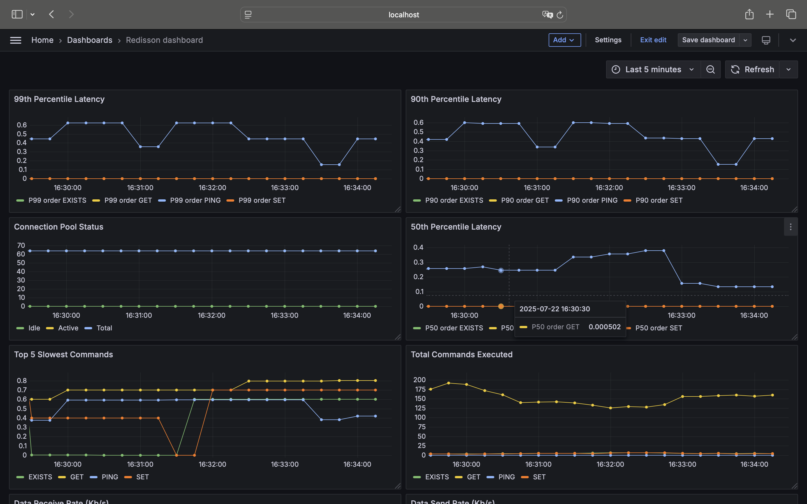

# Redisson-metrics

Redisson-metrics是一个专注于监控Redisson客户端性能的开源工具。通过收集和展示关键运行指标,帮助开发者更好地了解和优化Redis应用。

# 功能特点
- 实时监控Redisson客户端性能指标
- 与Grafana无缝集成,提供直观的数据可视化
- 支持自定义监控指标和告警规则
- 轻量级设计,对系统性能影响极小

# 监控指标

- 连接池状态
- 命令执行延迟
- 操作吞吐量
- 错误率统计



# 使用

应用引入依赖`spring-boot-started-redisson-metrics`。

```xml
<dependency>
    <groupId>metrics</groupId>
    <artifactId>spring-boot-starter-redisson-metrics</artifactId>
    <version>1.0.0-SNAPSHOT</version>
</dependency>
```